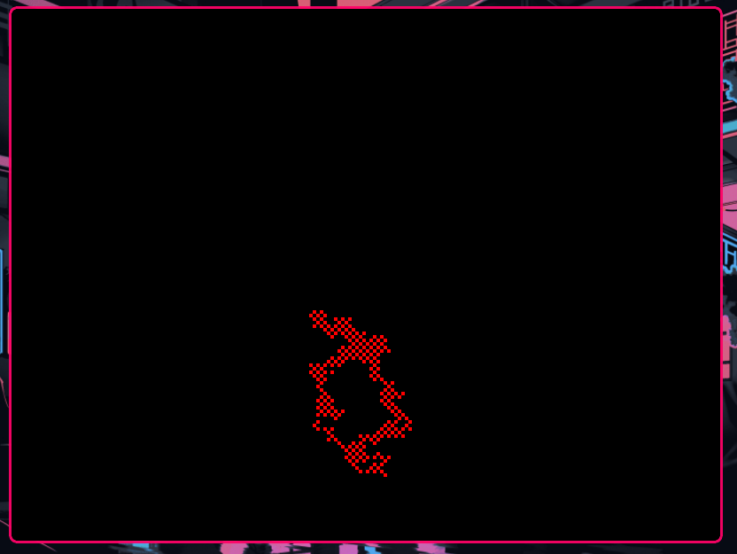

## Random Walker 
Inspired by CodingTrain on Youtube

### Dependicies
- [SDL2](https://www.libsdl.org)
- ```make``` (optional)

### Building 
```sh
git clone https://github.com/mustardfrog/random-walker
cd random-walker

make && ./main # if you have make installed

chmod +x build.sh # without make
./build.sh && ./main
```

